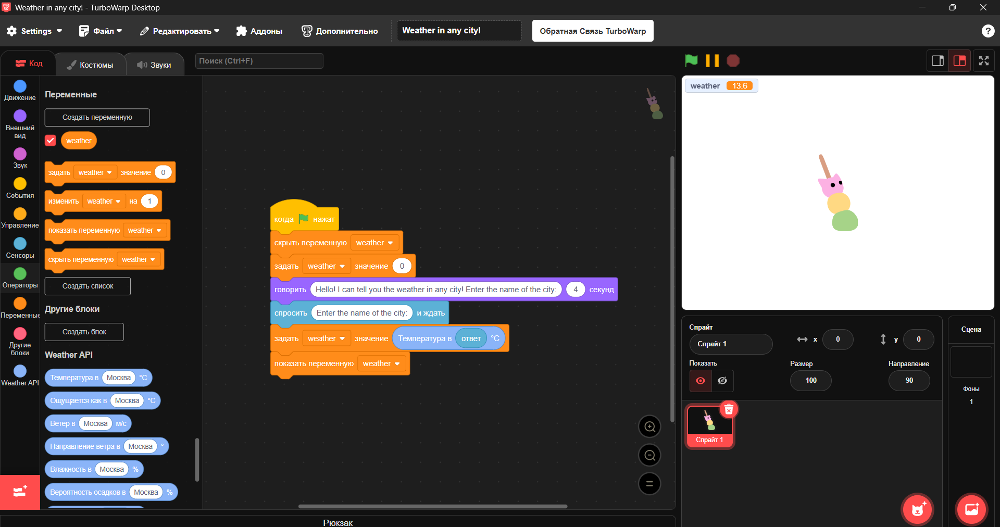

# weather-api-extension
# Weather API Extension for TurboWarp

**Weather API** — это расширение для TurboWarp, позволяющее получать актуальные погодные данные для любого города мира с помощью открытых погодных API.

---

## Возможности

- **Получение температуры, влажности, ветра, облачности и других погодных параметров по названию города.**
- **Все блоки работают на русском и английском языках.**
- **Можно использовать в интерактивных проектах, играх, чат-ботах, визуализациях и автоматизации.**

---

## Доступные блоки

| Блок                                      | Описание                                        |
|--------------------------------------------|-------------------------------------------------|
| **Температура в [ГОРОД] °C**               | Текущая температура воздуха                     |
| **Ощущается как в [ГОРОД] °C**             | Ощущаемая температура (аналогична текущей)      |
| **Ветер в [ГОРОД] м/с**                    | Скорость ветра                                  |
| **Направление ветра в [ГОРОД] °**          | Направление ветра в градусах                    |
| **Влажность в [ГОРОД] %**                  | Влажность воздуха                               |
| **Вероятность осадков в [ГОРОД] %**        | Вероятность выпадения осадков                   |
| **Облачность в [ГОРОД] %**                 | Процент облачности                              |
| **Давление в [ГОРОД] гПа**                 | Атмосферное давление                            |
| **Время рассвета в [ГОРОД]**               | Время восхода солнца                            |
| **Время заката в [ГОРОД]**                 | Время заката солнца                             |
| **Погода в [ГОРОД] как текст**             | Краткое текстовое описание погоды               |
| **Погода в [ГОРОД] (JSON)**                | Все погодные данные в формате JSON              |

---

## Как использовать

1. **Скопируйте код расширения** из файла [Weather-API.js](Weather-API.js) или этого репозитория.
2. **В TurboWarp** откройте меню **Addons → Custom Extension**.
3. **Вставьте код** или укажите ссылку на файл расширения.
4. **Используйте блоки** из категории **Weather API** для получения погодных данных по любому городу.

---

## Пример использования

когда ⚑ нажат
спросить [Введите город:] и ждать
задать [weather v] значение (Температура в (ответ) °C)
говорить (weather)

---

## Примеры проектов

- **Интерактивный погодный информер**
- **Автоматическая смена костюма спрайта в зависимости от погоды**
- **Погодный чат-бот**
- **Визуализация температуры на карте**

---

## Примечания

- **Расширение использует открытые API OpenStreetMap и Open-Meteo.**
- **Для корректной работы требуется интернет-соединение.**
- **В некоторых случаях (например, при ошибках CORS) может понадобиться запуск через локальный сервер-прокси.**

---

## Лицензия

MIT

---

**Если у вас есть вопросы или предложения — открывайте Issue или Pull Request!**
